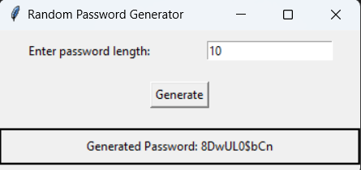

# Random-Password-generator

This Python code creates a simple **Random Password Generator** app using the **Tkinter** library for the graphical user interface (GUI) and the **random** and **string** modules to generate random passwords.

### Key Components:

1. **Password Generation Function**:
   - The function `generate_random_password(length=12)` creates a random password of the specified length. It uses a combination of uppercase and lowercase letters, digits, and punctuation characters as the character set for the password.
   - It uses the `random.choice()` function to pick random characters from this set and constructs the password by repeating this process for the desired password length.

2. **User Input**:
   - The user is prompted to enter a password length via an entry box (`length_entry`). The input is then used to determine how long the generated password should be.

3. **Password Generation Button**:
   - There is a "Generate" button that, when clicked, triggers the `on_generate()` function. This function fetches the length entered by the user, calls the password generation function, and displays the generated password on the screen.
   - If the user enters an invalid value (like a non-numeric character), an error message is shown.

4. **GUI Layout**:
   - The app features a basic Tkinter window with a label prompting the user to enter the password length.
   - An entry widget allows the user to type the desired length.
   - A button labeled "Generate" triggers the password creation.
   - The generated password is displayed in a label below the button.

5. **Error Handling**:
   - If the user enters an invalid length (such as a negative number or a non-numeric value), an error message is displayed, instructing the user to provide a valid length.

### How It Works:
- The user enters a number in the input field to specify the desired length of the password.
- When the "Generate" button is clicked, the app generates a password of that length using the characters from letters, digits, and punctuation.
- The generated password is then displayed in the window for the user to view and use.

This app provides an easy and interactive way for users to create secure, random passwords with customizable lengths.